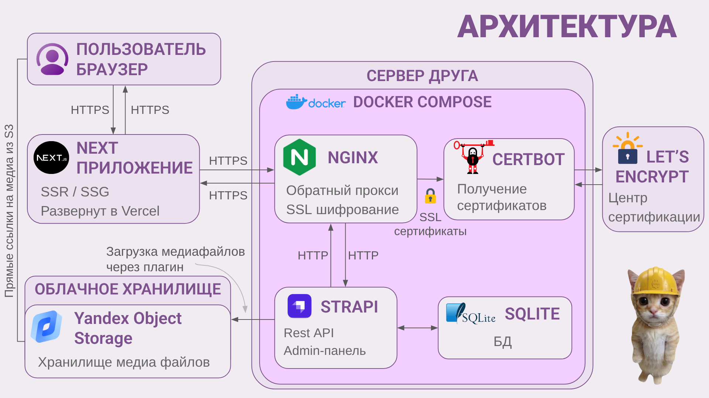

#  Knitting

<p align="center">
  <b>English</b> • <a href="README.ru.md">Русский</a>
</p>

<div align="center">


</div>

A digital platform for knitting enthusiasts, allowing them to create tutorials, select tools (knitting needles, crochet hooks), design patterns, and share their creativity.

## Features
- **Tutorial Catalog:** Browse the list of available tutorials.
- **Search & Filtering:** Find lessons by keywords and selected categories.
- **Infinite Scrolling:** Automatic loading of tutorials as you scroll down the page.
- **Authentication:** Secure user login and registration.
- **Favorites:** Ability to save your favorite tutorials.
- **Responsive Design:** Optimized for seamless use across mobile devices, tablets, and desktops.
- **Tutorial Creation:** Authorized users can create and publish tutorials that will be available to all site visitors.

## Tech Stack

- **Core:** Next.js (App Router), TypeScript, React.
- **State Management:** MobX (with hydration support).
- **Styles:** SCSS Modules, BEM, `next-themes` (dark/light modes).
- **Performance:** Client-side image compression before S3 upload.
- **Analytics:** Yandex Metrica (traffic and user behavior monitoring).

## Environment Setup
Create a `.env` file in the root of the project and add the following variables:
```env
NEXT_PUBLIC_STRAPI_URL=your_backend_url
NEXT_PUBLIC_YM_ID=your_id
```

If the backend is running locally on port 1337 (http://localhost:1337), the `NEXT_PUBLIC_STRAPI_URL` variable is not required.

## Local Development

To run the platform fully, both the client and server parts need to be set up.

### 1. Backend Setup (Required)

This project works in conjunction with **Strapi 5**.

The frontend receives all data via API. Before launching the client side, ensure the backend is configured and running.

- **Repository:** [knitting-backend](https://github.com/LenkaDEA/knitting-backend)
- Go to the backend repository and follow the local instructions to start Strapi and link your S3 bucket.

### 2. Frontend Launch

1. Clone the repository and navigate to the project directory:
```bash
git clone https://github.com/LenkaDEA/knitting-next.git
cd knitting-next
```
2. Install dependencies using your preferred package manager:
```bash
npm install
# or
yarn install
```
3. Start the development server:
```bash
npm run dev
# или
yarn dev
```
4. Open in browser: The application will be available at http://localhost:3000

## Project Architecture


## Yandex Metrica Tracking Scenarios

| Scenario | Event Description | Value |
| :--- | :--- | :--- |
| **Add to Favorites** | Navigation to a tutorial (from the main page or profile) | `click_card` |
| | Adding a tutorial to favorites | `click_like` |
| **Tutorial Creation** | Initiation of the creation process (button click) | `click_create_pattern` |
| | Successful tutorial save | `click_save_pattern` |
| | Error during data validation or saving | `error_save_pattern` |
| **Registration** | Navigation to the user registration form | `click_signup` |
| | Successful registration completion (account creation) | `registration_success` |
| **Authentication** | Account logout | `click_logout` |


## License
This project is licensed under the [MIT License](https://opensource.org/licenses/MIT).